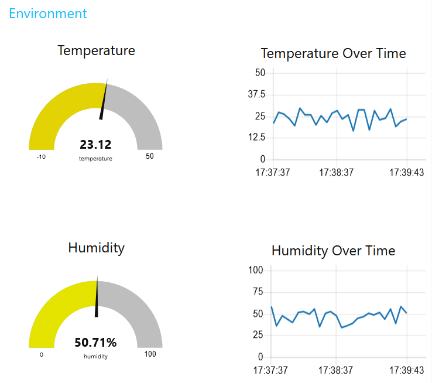
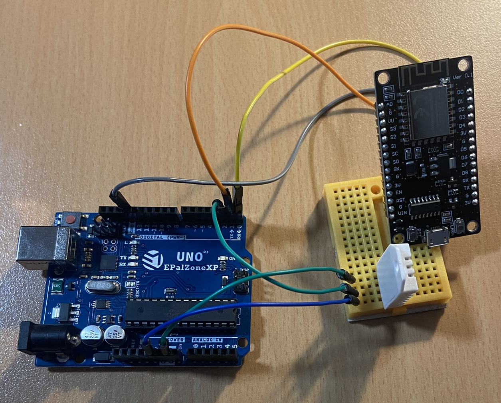

# Smart Home Temperature and Humidity Monitoring System

## Project Overview
This project aims to develop and simulate a smart home temperature and humidity monitoring system

## Technologies Used
- **MQTT**: For data communication
- **Node-RED**: For data visualisation
- **Python**: For simulating sensor data

## Components List
- **DHT22 Sensor**: Measures temperature and humidity.
- **ESP8266 NodeMCU 1.0**: WiFi-enabled microcontroller for sending data online.
- **Arduino Uno**: Microcontroller

## Setup and Installation
### Prerequisites
- Arduino IDE or any relevant development environment
- Access to Node-RED
- MQTT broker setup (e.g., Mosquitto)

# Dependencies
Following Python libraries:
- `paho-mqtt`: For handling MQTT communications
- `json`: For parsing and constructing JSON objects

### Installing Libraries
Ensure you have the following libraries installed for your Arduino setup:
- `DHT.h`
- `ESP8266WiFi.h`
- `PubSubClient.h`
